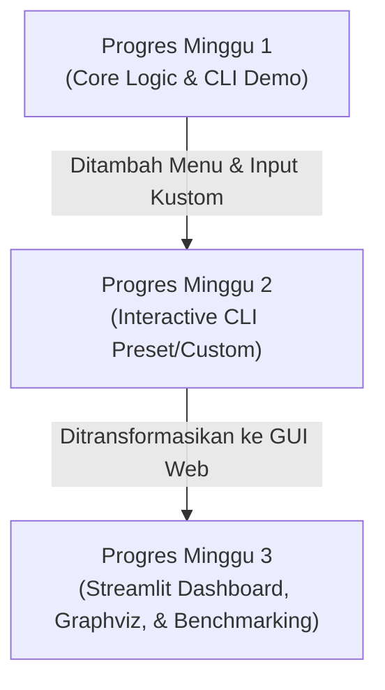

# Penjelasan Konsep & Progres Pembuatan Aplikasi Pemilihan Tim Proyek

Dokumen ini menjelaskan konsep dasar algoritma dan perkembangan aplikasi **Optimasi Pemilihan Tim Proyek** dari **Minggu 1** hingga **Minggu 3**. Dokumen ini dirancang untuk membantu Anda memahami alur kerja, logika algoritma, dan bagaimana setiap bagian kode saling terhubung.

---

## 1. Konsep Utama Aplikasi

### Masalah yang Diselesaikan (Problem Statement)
Aplikasi ini menyelesaikan masalah **Seleksi Tim Proyek dengan Batas Anggaran**. Diberikan:
1. Sekumpulan $n$ kandidat, di mana setiap kandidat memiliki tarif/biaya tertentu.
2. Ukuran tim yang diinginkan ($k$ orang).
3. Anggaran maksimal ($B$ rupiah).

**Tujuannya** adalah memilih persis $k$ kandidat dari total $n$ kandidat sedemikian rupa sehingga:
- Total biaya dari $k$ kandidat tersebut **seminimum mungkin**.
- Total biaya **tidak melebihi anggaran** $B$ ($\text{Total Cost} \le B$).

Secara matematis, ini mirip dengan variasi dari *Knapsack Problem* atau kombinasi optimasi, di mana ruang pencariannya tumbuh secara eksponensial (kombinatorial $C(n, k)$).

---

### Mengapa Menggunakan Algoritma *Branch and Bound*?
Jika kita menggunakan **Brute Force**, kita harus mencoba seluruh kombinasi kemungkinan:
$$\text{Kombinasi} = \frac{n!}{k!(n-k)!}$$
Untuk $n=24$ dan $k=9$, terdapat **1.307.504** kemungkinan kombinasi. Jika $n$ bertambah sedikit saja, komputer akan melambat atau mengalami *freeze*.

**Branch and Bound (B&B)** memecahkan masalah ini dengan cara yang cerdas:
1. **Branching (Percabangan)**: Memecah masalah menjadi sub-masalah yang lebih kecil dan merepresentasikannya dalam bentuk **Pohon Ruang Status (State Space Tree)**. Setiap node di pohon melambangkan keputusan untuk memilih kandidat tertentu.
2. **Bounding (Pembatasan/Lower Bound)**: Untuk setiap node, kita menghitung batas bawah estimasi biaya terkecil yang bisa dicapai jika kita melanjutkan pencarian dari node tersebut.
3. **Pruning (Pemangkasan)**: Jika batas bawah (*Lower Bound*) dari suatu node sudah lebih besar dari biaya solusi terbaik yang sudah ditemukan sejauh ini (atau melebihi anggaran $B$), maka cabang tersebut **dipangkas** (dibuang) karena tidak mungkin menghasilkan solusi yang lebih baik. Ini menghemat waktu komputasi secara drastis.

---

## 2. Struktur Kode Utama (Shared Core)

Logika utama ini digunakan di semua progres (Minggu 1, 2, dan 3) agar hasilnya konsisten:

- **`models.py`**: Berisi tiga struktur data (Dataclass):
  - [Candidate](file:///c:/Semester%204/Strago/Tubes/-C-Pemilihan-Tim-Project--main/-C-Pemilihan-Tim-Project--main/Proggres%20minggu%201/models.py#L4-L15): Menyimpan ID, nama, dan biaya kandidat.
  - [BBNode](file:///c:/Semester%204/Strago/Tubes/-C-Pemilihan-Tim-Project--main/-C-Pemilihan-Tim-Project--main/Proggres%20minggu%201/models.py#L16-L27): Merepresentasikan sebuah node dalam pohon pencarian (menyimpan daftar kandidat terpilih sejauh ini, total biaya saat ini, nilai batas bawah, status apakah dipangkas, dsb.).
  - [SolveResult](file:///c:/Semester%204/Strago/Tubes/-C-Pemilihan-Tim-Project--main/-C-Pemilihan-Tim-Project--main/Proggres%20minggu%201/models.py#L28-L39): Menyimpan output pemecahan masalah seperti tim terbaik, total biaya optimal, statistika node yang dieksplorasi/dipangkas, waktu komputasi, dan struktur pohon.

- **`algorithm.py`**: Berisi kelas [BranchAndBound](file:///c:/Semester%204/Strago/Tubes/-C-Pemilihan-Tim-Project--main/-C-Pemilihan-Tim-Project--main/Proggres%20minggu%201/algorithm.py#L6).
  - **Inisialisasi**: Kandidat diurutkan berdasarkan biaya dari terkecil ke terbesar (`sorted(candidates, key=lambda c: c.cost)`). Pengurutan ini sangat krusial untuk efisiensi *Lower Bound*.
  - **`_lower_bound`**: Menghitung estimasi biaya minimum dengan rumus:
    $$\text{Lower Bound} = \text{Biaya Tim Saat Ini} + \text{Biaya } (\text{sisa slot yang dibutuhkan}) \text{ dari kandidat termurah yang tersisa}$$
  - **`_bb` (Rekursi Utama)**: Fungsi rekursif DFS (Depth First Search) untuk menjelajahi pohon pencarian.
    - Jika ukuran tim sudah mencapai $k$, periksa apakah biayanya lebih murah dari solusi terbaik sebelumnya dan tidak melebihi $B$.
    - Jika sisa kandidat yang belum diproses tidak cukup untuk memenuhi target tim $k$, node langsung **dipangkas** (`pruned = True`).
    - Jika *Lower Bound* lebih besar dari solusi terbaik yang ditemukan atau melebihi $B$, node langsung **dipangkas**.
    - Jika tidak dipangkas, lanjutkan percabangan ke kandidat berikutnya.

---

## 3. Penjelasan Tiap Progres Mingguan

Berikut adalah evolusi aplikasi dari minggu ke minggu:

### Progres Minggu 1: Fondasi Logika & CLI Demo
Progres pertama berfokus pada pembuktian logika algoritma Branch & Bound berjalan dengan benar.

- **Fokus Utama**: Implementasi dasar B&B dan pengujian kebenaran kode.
- **Cara Kerja**:
  - Menggunakan dataset statis (tetap) berisi 12 kandidat dengan target tim $k=5$ dan anggaran $B=100.000.000$.
  - Ketika dijalankan melalui [main_minggu1.py](file:///c:/Semester%204/Strago/Tubes/-C-Pemilihan-Tim-Project--main/-C-Pemilihan-Tim-Project--main/Proggres%20minggu%201/main_minggu1.py), program langsung mengeksekusi solver dan mencetak:
    1. Daftar kandidat awal.
    2. Anggota tim optimal yang terpilih beserta total biayanya.
    3. Ringkasan proses (jumlah node dieksplorasi, dipangkas, dan persentase efisiensi).
    4. Tim alternatif dengan biaya setara (jika ada).
    5. **ASCII Search Tree**: Visualisasi struktur pohon pencarian B&B sederhana di terminal menggunakan teks indentasi bergaya pohon folder (`|--` dan `` `-- ``).
  - Dilengkapi dengan unit test awal di `test_algorithm.py` untuk menjamin logika perhitungan tidak salah.

---

### Progres Minggu 2: Menu Interaktif & Customization
Progres kedua meningkatkan fungsionalitas CLI agar pengguna dapat berinteraksi dengan program dan menggunakan data yang dinamis tanpa perlu mengubah kode sumber.

- **Fokus Utama**: Fleksibilitas input dan interaksi pengguna.
- **Peningkatan & Fitur Baru**:
  - **Sistem Menu CLI**: Menampilkan menu pilihan (1-4) interaktif di terminal melalui [main_minggu2.py](file:///c:/Semester%204/Strago/Tubes/-C-Pemilihan-Tim-Project--main/-C-Pemilihan-Tim-Project--main/Progress%20minggu%202/main_minggu2.py).
  - **Preset Dataset**: Menyediakan 3 pilihan dataset bawaan dengan tingkat kesulitan berbeda:
    - **Small**: $n=12, k=5, B=100.000.000$
    - **Medium**: $n=18, k=7, B=140.000.000$
    - **Large**: $n=24, k=9, B=180.000.000$
  - **Tweak Parameter**: Pengguna bebas mengubah nilai $k$ dan $B$ meskipun menggunakan preset.
  - **Dataset Kustom**: Pengguna bisa menentukan jumlah $n$, $k$, dan $B$ sendiri, lalu memilih cara pengisian data:
    - *Input Manual*: Mengetikkan nama dan tarif kandidat satu per satu.
    - *Auto-Generate*: Menghasilkan nama dan tarif acak secara otomatis untuk simulasi skala besar.
  - **Unit Test yang Diperluas**: Menambahkan pengujian untuk dataset berukuran besar (`test_large`) untuk memastikan performa algoritma tetap cepat.

---

### Progres Minggu 3: Implementasi Web GUI (Streamlit) & Visualisasi
Progres ketiga mengubah seluruh antarmuka CLI menjadi aplikasi berbasis web yang interaktif, visual, dan ramah pengguna (*User Friendly*).

- **Fokus Utama**: Antarmuka visual yang modern, visualisasi grafis, dan portabilitas data.
- **Pemisahan Modul (Modular Architecture)**:
  - **`app.py`**: Mengontrol visualisasi halaman web menggunakan pustaka **Streamlit**. Menyediakan sidebar konfigurasi untuk input parameter.
  - **`data_handler.py`**: Bertanggung jawab memproses data (mengambil preset, membuat data acak, mengonversi struktur `Candidate` ke Tabel Pandas/Streamlit, dan sebaliknya).
  - **`visualizer.py`**: Bertanggung jawab menggambar grafik performa dan pohon keputusan.
- **Peningkatan & Fitur Baru**:
  - **Interactive Data Editor**: Menampilkan tabel kandidat yang bisa diedit langsung di web (menambah, menghapus, atau mengubah nama/biaya kandidat secara langsung).
  - **Visualisasi Pohon Keputusan (Graphviz)**: Menghasilkan graf pohon ruang status yang indah menggunakan Graphviz. Setiap node diberi warna untuk memudahkan pemahaman konsep B&B:
    - **Hijau**: Solusi optimal yang terpilih.
    - **Biru**: Node yang dieksplorasi (aktif).
    - **Merah**: Cabang yang dipangkas (*Pruned*) karena tidak efisien atau melebihi anggaran.
  - **Benchmarking Performa**: Menyediakan tab perbandingan kecepatan eksekusi (milidetik) antara algoritma *Branch and Bound* vs *Brute Force* dalam bentuk grafik batang (Matplotlib) untuk membuktikan efisiensi B&B.
  - **Import/Export CSV**:
    - Pengguna dapat mengunduh daftar kandidat sebagai file CSV.
    - Pengguna dapat mengunggah file CSV buatan sendiri untuk diproses.
    - Hasil seleksi tim optimal dapat diunduh langsung dalam format CSV.

---

## 4. Rangkuman Evolusi Kode

| Fitur | Progres Minggu 1 | Progres Minggu 2 | Progres Minggu 3 |
| :--- | :--- | :--- | :--- |
| **Antarmuka (UI)** | Terminal CLI Statis | Terminal CLI Interaktif (Menu) | Web GUI (Streamlit Dashboard) |
| **Sumber Data** | Statis Hardcoded ($n=12$) | Preset & Input Kustom (Manual/Acak) | Preset, Acak, Input Tabel, & Upload CSV |
| **Visualisasi Pohon**| Teks ASCII (`|--`) | Teks ASCII (`|--`) | Graf Gambar (Graphviz) berwarna |
| **Benchmarking** | Tidak ada | Tidak ada | Grafik Bar (B&B vs Brute Force) |
| **Eksplorasi Data** | Hanya cetak hasil | Cetak tabel hasil | Tabel interaktif & Ekspor/Unduh CSV |

Dengan pemisahan kode yang rapi, Anda dapat melihat bahwa inti algoritma (`algorithm.py` dan `models.py`) tetap sama dari minggu pertama hingga ketiga, membuktikan bahwa peningkatan arsitektur sistem dilakukan di lapisan presentasi (UI) dan pengolahan data pendukung tanpa merusak logika dasar matematika optimasi yang telah teruji.
