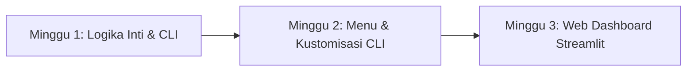

# LAPORAN TUGAS BESAR
## OPTIMASI PEMILIHAN TIM PROYEK BERBASIS ALGORITMA BRANCH AND BOUND

---

## 1. Deskripsi Persoalan

### Latar Belakang Masalah
Dalam manajemen proyek, pembentukan tim kerja yang efisien merupakan salah satu kunci keberhasilan. Manajer proyek dihadapkan pada tantangan untuk memilih anggota tim dari sekumpulan kandidat yang tersedia. Setiap kandidat memiliki tarif atau biaya sewa jasa (*salary/cost*) yang berbeda-beda. 

Persoalan utama yang diselesaikan adalah **mencari kombinasi terbaik dari $k$ kandidat dari total pool $n$ kandidat agar menghasilkan total biaya yang seminimal mungkin, tanpa melebihi batas anggaran (budget) $B$ yang telah ditentukan.**

Secara formal, persoalan ini dapat didefinisikan sebagai berikut:
- **Input**:
  - Pool kandidat $C = \{c_1, c_2, ..., c_n\}$, di mana setiap kandidat $c_i$ memiliki biaya jasa $cost(c_i)$.
  - Ukuran tim target $k$ (jumlah kandidat yang harus dipilih).
  - Anggaran maksimal $B$.
- **Output**:
  - Subset tim terpilih $T \subset C$ dengan ukuran $|T| = k$.
  - Meminimalkan total biaya: $\sum_{c \in T} cost(c) \to \text{minimum}$.
  - Memenuhi kendala anggaran: $\sum_{c \in T} cost(c) \le B$.

### Kompleksitas Kombinatorial
Jika diselesaikan dengan pendekatan **Brute Force**, kita harus memeriksa semua kombinasi $C(n, k)$ kemungkinan tim. Rumus kombinasi tersebut adalah:
$$C(n, k) = \frac{n!}{k!(n-k)!}$$
Untuk jumlah kandidat yang kecil (misalnya $n=12$ dan $k=5$), terdapat $C(12, 5) = 792$ kombinasi. Namun, seiring bertambahnya $n$ dan $k$, ruang solusi membesar secara eksponensial (misalnya $n=30$ dan $k=10$ menghasilkan **30.045.015** kemungkinan). Pencarian secara brute force pada skala ini akan memakan waktu komputasi yang sangat lama dan memboroskan sumber daya sistem komputer. Oleh karena itu, diperlukan pendekatan algoritmik yang lebih efisien seperti **Branch and Bound**.

---

## 2. Deskripsi Solusi

Untuk memecahkan masalah ini dengan efisien, aplikasi dirancang menggunakan algoritma **Branch and Bound (B&B)** dengan strategi pencarian **Depth-First Search (DFS)** dan pengurutan data awal (*Sorting*) untuk mempercepat pemangkasan cabang.

### Pemodelan Data (`models.py`)
Data dimodelkan menggunakan Python Dataclass untuk keterbacaan dan kebersihan kode:
1. `Candidate`: Menyimpan informasi dasar tiap kandidat seperti ID, nama, dan biaya.
2. `BBNode`: Menyimpan status node pada pohon ruang status (State Space Tree), mencakup tingkat kedalaman pohon (`level`), indeks kandidat yang dipilih (`selected`), total biaya sejauh ini (`total_cost`), serta nilai batas bawah (`lower_bound`).
3. `SolveResult`: Menyimpan kumpulan data hasil optimasi seperti daftar tim terbaik, biaya terbaik, jumlah node yang dijelajahi dan dipangkas, serta durasi eksekusi.

### Logika Algoritma Branch & Bound (`algorithm.py`)

#### A. Pengurutan Awal (Sorting)
Sebelum melakukan pencarian, seluruh kandidat diurutkan berdasarkan biaya dari yang terkecil hingga terbesar:
$$\text{cost}(c_1) \le \text{cost}(c_2) \le \dots \le \text{cost}(c_n)$$
Pengurutan ini sangat krusial karena membantu menghitung nilai *Lower Bound* yang ketat (optimistis namun valid) dan mempercepat penemuan solusi murah di awal proses DFS.

#### B. Perhitungan Batas Bawah (Lower Bound)
Untuk setiap node di level tertentu, nilai *Lower Bound* ($LB$) dihitung dengan menjumlahkan biaya kandidat yang sudah dipilih ditambah dengan kandidat termurah yang masih tersedia di level berikutnya untuk memenuhi ukuran tim $k$.
$$\text{LB} = \text{Biaya Tim Saat Ini} + \sum_{i=1}^{k - |T|} \text{cost}(c_{\text{indeks\_berikutnya} + i - 1)}$$
Jika sisa kandidat yang tersedia lebih sedikit dari slot tim yang dibutuhkan ($k - |T|$), nilai $LB$ diset ke nilai tak hingga ($\infty$) karena node tersebut tidak mungkin menghasilkan solusi yang valid (tidak feasible).

#### C. Pemangkasan (Pruning)
Sebuah node pencarian akan **dipangkas** (tidak dijelajahi lebih dalam ke bawah cabangnya) apabila memenuhi salah satu kondisi berikut:
1. **Jumlah kandidat tidak mencukupi**: Sisa kandidat di pool tidak cukup untuk mengisi sisa slot tim $k$ yang dibutuhkan.
2. **Melebihi Anggaran**: *Lower Bound* atau biaya tim saat ini sudah melebihi anggaran maksimal $B$ ($\text{LB} > B$).
3. **Lebih Mahal dari Solusi Terbaik Sementara**: *Lower Bound* lebih besar atau sama dengan biaya tim optimal terbaik yang sudah ditemukan sejauh ini ($\text{LB} \ge \text{best\_cost}$).

---

## 3. Deskripsi Perkembangan Progres (Minggu 1 - Minggu 3)

Proyek ini dikerjakan secara bertahap selama 3 minggu dengan pendekatan pengembangan modular dan evolusioner:



### A. Minggu 1 (Fase Awal - Pembangunan Logika Inti & CLI Demo)
Fokus pada minggu pertama adalah merancang struktur data dasar dan memastikan logika algoritma Branch and Bound berjalan dengan benar secara matematis.
- **Hasil Pekerjaan**:
  - Membuat model data di [models.py](file:///c:/Semester%204/Strago/Tubes/-C-Pemilihan-Tim-Project--main/-C-Pemilihan-Tim-Project--main/Proggres%20minggu%201/models.py) dan kelas pemecah masalah [BranchAndBound](file:///c:/Semester%204/Strago/Tubes/-C-Pemilihan-Tim-Project--main/-C-Pemilihan-Tim-Project--main/Proggres%20minggu%201/algorithm.py#L6).
  - Membuat simulasi program terminal CLI di [main_minggu1.py](file:///c:/Semester%204/Strago/Tubes/-C-Pemilihan-Tim-Project--main/-C-Pemilihan-Tim-Project--main/Proggres%20minggu%201/main_minggu1.py) menggunakan dataset statis (tetap) berukuran $n=12$ kandidat, target tim $k=5$, dan anggaran $B=100.000.000$ rupiah.
  - Mengimplementasikan visualisasi pohon keputusan sederhana berbasis teks (**ASCII Search Tree**) di terminal untuk melacak node mana saja yang dieksplorasi, terpilih, atau dipangkas.
  - Membuat unit test awal di [test_algorithm.py](file:///c:/Semester%204/Strago/Tubes/-C-Pemilihan-Tim-Project--main/-C-Pemilihan-Tim-Project--main/Proggres%20minggu%201/test_algorithm.py) untuk menguji kebenaran algoritma pada kasus dasar dan kasus tanpa solusi.

### B. Minggu 2 (Fase Menengah - Penambahan Menu Interaktif & Kustomisasi)
Fokus minggu kedua adalah meningkatkan interaksi pengguna pada terminal CLI sehingga aplikasi dapat memproses data dinamis tanpa perlu mengubah kode sumber.
- **Hasil Pekerjaan**:
  - Mengembangkan sistem menu interaktif (opsi 1-4) di [main_minggu2.py](file:///c:/Semester%204/Strago/Tubes/-C-Pemilihan-Tim-Project--main/-C-Pemilihan-Tim-Project--main/Progress%20minggu%202/main_minggu2.py).
  - Menyediakan 3 pilihan dataset preset bawaan: *Small* (n=12), *Medium* (n=18), dan *Large* (n=24).
  - Memberikan kebebasan bagi pengguna untuk mengubah parameter $k$ dan $B$ secara langsung saat menjalankan program.
  - Membuat fitur **Dataset Kustom** yang memungkinkan pengguna menginput data kandidat secara manual satu per satu atau menghasilkan data biaya kandidat secara acak (*Auto-Generate*).
  - Memperluas pengujian unit test dengan menambahkan pengujian untuk dataset berukuran besar (`test_large`) guna memastikan kinerja algoritma tetap stabil di bawah 1 detik.

### C. Minggu 3 (Fase Akhir - Web GUI Dashboard, Visualisasi Grafis, & Portabilitas)
Fokus minggu ketiga adalah melakukan transformasi antarmuka dari CLI berbasis teks ke antarmuka grafis berbasis web agar lebih mudah digunakan oleh pengguna awam, serta meningkatkan portabilitas data.
- **Hasil Pekerjaan**:
  - Membuat dashboard web interaktif menggunakan framework **Streamlit** di [app.py](file:///c:/Semester%204/Strago/Tubes/-C-Pemilihan-Tim-Project--main/-C-Pemilihan-Tim-Project--main/Progress%20minggu%203/app.py).
  - Memisahkan logika manipulasi data ke [data_handler.py](file:///c:/Semester%204/Strago/Tubes/-C-Pemilihan-Tim-Project--main/-C-Pemilihan-Tim-Project--main/Progress%20minggu%203/data_handler.py) (import/export CSV, editing dataframe).
  - Membuat visualisasi grafis pohon keputusan secara dinamis menggunakan **Graphviz** di [visualizer.py](file:///c:/Semester%204/Strago/Tubes/-C-Pemilihan-Tim-Project--main/-C-Pemilihan-Tim-Project--main/Progress%20minggu%203/visualizer.py), lengkap dengan pewarnaan node (Hijau = Solusi Optimal, Biru = Eksplorasi, Merah = Dipangkas).
  - Menyediakan fitur *benchmarking* performa komputasi antara algoritma Branch & Bound vs Brute Force menggunakan grafik batang **Matplotlib**.
  - Mengintegrasikan fitur unggah berkas CSV kandidat kustom, edit data secara langsung di tabel halaman web, serta unduh hasil tim optimal ke berkas CSV.

---

## 4. Deskripsi Hasil Pengujian (Tampilan Input/Output)

### A. Pengujian Berbasis CLI (Minggu 1 & Minggu 2)
Pengujian terminal CLI dilakukan menggunakan dataset preset **Small (n=12, k=5, B=100.000.000)**. 

#### Tampilan Hasil Output di Terminal CLI:
```text
============================================================
  DEMO PEMILIHAN TIM PROYEK — Branch & Bound (Minggu 1)
============================================================

  Jumlah kandidat (n) : 12
  Ukuran tim (k)      : 5
  Anggaran maks (B)   : Rp 100,000,000

  DAFTAR KANDIDAT:
    No  Nama               Biaya (Rp)
  ------------------------------------
     1  Andi               15,000,000
     2  Budi               25,000,000
     3  Citra              10,000,000
     4  Dewi               30,000,000
     5  Eka                20,000,000
     6  Fajar              35,000,000
     7  Gita               12,000,000
     8  Hani               28,000,000
     9  Irfan              18,000,000
    10  Joko               22,000,000
    11  Kiki               40,000,000
    12  Lina               16,000,000

============================================================
  OUTPUT 1 — TIM TERPILIH & TOTAL BIAYA
============================================================

  TIM TERPILIH:
  Nama               Biaya (Rp)
  ------------------------------
  Citra              10,000,000
  Gita               12,000,000
  Andi               15,000,000
  Lina               16,000,000
  Irfan              18,000,000
  ------------------------------
  Total Biaya        71,000,000
  Sisa Anggaran      29,000,000

============================================================
  OUTPUT 2 — RINGKASAN PROSES B&B
============================================================

  Node dieksplorasi  : 41
  Node dipangkas     : 28
  Solusi feasible    : 8
  Efisiensi pruning  : 68.3%
  Waktu komputasi    : 0.2313 ms

============================================================
  FITUR TAMBAHAN — PELACAK POHON PENCARIAN B&B (ASCII TREE)
============================================================

  `-- root  Biaya=Rp 0  LB=Rp 71,000,000  [AKTIF]
      |-- [3]  Biaya=Rp 10,000,000  LB=Rp 71,000,000  [AKTIF]
      |   |-- [3,7]  Biaya=Rp 22,000,000  LB=Rp 71,000,000  [AKTIF]
      |   |   |-- [3,7,1]  Biaya=Rp 37,000,000  LB=Rp 71,000,000  [AKTIF]
      |   |   |   |-- [3,7,1,12]  Biaya=Rp 53,000,000  LB=Rp 71,000,000  [AKTIF]
      |   |   |   |   |-- [3,7,1,12,9]  Biaya=Rp 71,000,000  LB=Rp 71,000,000  << SOLUSI OPTIMAL >>
      |   |   |   |   |-- [3,7,1,12,5]  Biaya=Rp 73,000,000  LB=Rp 73,000,000  [AKTIF]
      |   |   |   |   |...
      |   |   |   |-- [3,7,1,9]  Biaya=Rp 55,000,000  LB=Rp 75,000,000  [DIPANGKAS]
      |   |   |   |-- [3,7,1,5]  Biaya=Rp 57,000,000  LB=Rp 79,000,000  [DIPANGKAS]
```

#### Analisis Hasil Pengujian CLI:
* Algoritma berhasil menemukan tim optimal dengan total biaya **Rp 71.000.000** (terdiri dari Citra, Gita, Andi, Lina, Irfan) yang berada di bawah anggaran Rp 100.000.000.
* Efisiensi pruning mencapai **68.3%** di mana dari total kemungkinan kombinasi tim, hanya 41 node yang dieksplorasi dan 28 node berhasil dipangkas, sehingga komputasi selesai dalam waktu sangat singkat (**0.23 ms**).

---

### B. Pengujian Berbasis Web GUI (Minggu 3)
Aplikasi berbasis web dijalankan menggunakan Streamlit. Antarmuka dibagi menjadi dua area utama: Sidebar Input Konfigurasi (Kiri) dan Dashboard Hasil Visualisasi (Kanan).

#### 1. Tampilan Input Konfigurasi (Sidebar)
* Pengguna dapat memilih sumber data: **Gunakan Preset**, **Generate Acak**, atau **Upload CSV**.
* Input numerik interaktif disediakan untuk mengatur:
  * Jumlah kandidat ($n$)
  * Ukuran Tim ($k$)
  * Anggaran Maksimal ($B$) dengan tampilan format mata uang rupiah yang rapi.
* Dilengkapi dengan tombol **"Jalankan Optimasi"** dan **"Download Template CSV"**.

#### 2. Tampilan Output Hasil Optimasi (Tabs Panel)
Hasil pencarian disajikan secara elegan ke dalam tiga tab panel:
* **Tab 1: Tim Terpilih & Statistik**:
  * Menampilkan tabel anggota tim optimal yang terpilih (ID, Nama, Biaya).
  * Info total biaya dan sisa anggaran proyek yang disorot dengan kartu informasi.
  * Kartu metrik statistik B&B: Node Dieksplorasi, Node Dipangkas, Persentase Efisiensi Pruning, dan Waktu Komputasi.
* **Tab 2: Visualisasi Pohon (Graphviz)**:
  * Menampilkan graf pohon keputusan berwarna. Node berwarna **Hijau** mewakili solusi optimal, **Biru** mewakili node aktif yang dieksplorasi, dan **Merah** mewakili cabang pohon yang dipangkas (*Pruned*).
* **Tab 3: Benchmarking B&B vs Brute Force**:
  * Grafik perbandingan performa waktu eksekusi (milidetik) dalam bentuk diagram batang untuk membuktikan secara empiris bahwa algoritma Branch & Bound berjalan berkali-kali lipat lebih cepat daripada Brute Force.

---

## 5. Lampiran Kode Sumber

Berikut adalah bagian kode sumber penting yang membentuk aplikasi ini. Anda dapat mengakses kode lengkap di repositori:

### A. Model Data ([models.py](file:///c:/Semester%204/Strago/Tubes/-C-Pemilihan-Tim-Project--main/-C-Pemilihan-Tim-Project--main/Progress%20minggu%203/models.py))
```python
from dataclasses import dataclass, field
from typing import List, Optional

@dataclass
class Candidate:
    id: int
    name: str
    cost: int

    def __repr__(self):
        return f"Candidate(id={self.id}, name={self.name!r}, cost={self.cost:,})"

    def display(self) -> str:
        return f"[{self.id:>2}] {self.name:<14} Rp {self.cost:>12,}"

@dataclass
class BBNode:
    node_id: int
    parent_id: Optional[int]
    level: int
    selected: List[int]
    total_cost: int
    lower_bound: int
    pruned: bool = False
    is_solution: bool = False
    label: str = ""

@dataclass
class SolveResult:
    best_team: List[int]
    best_cost: int
    is_feasible: bool
    nodes_explored: int
    nodes_pruned: int
    nodes_feasible: int
    elapsed_sec: float
    tree_nodes: List[BBNode] = field(default_factory=list)
    all_solutions: List[dict] = field(default_factory=list)
```

### B. Algoritma Utama B&B ([algorithm.py](file:///c:/Semester%204/Strago/Tubes/-C-Pemilihan-Tim-Project--main/-C-Pemilihan-Tim-Project--main/Progress%20minggu%203/algorithm.py))
```python
import time
from typing import List
from models import Candidate, BBNode, SolveResult

class BranchAndBound:
    def __init__(self, candidates: List[Candidate], k: int, B: int):
        self.candidates = sorted(candidates, key=lambda c: c.cost)
        self.k = k
        self.B = B
        self.n = len(candidates)
        self._best_cost = float('inf')
        self._best_team = []
        self._node_counter = 0
        self._nodes_explored = 0
        self._nodes_pruned = 0
        self._nodes_feasible = 0
        self._tree_nodes = []
        self._all_solutions = []

    def solve(self) -> SolveResult:
        t0 = time.perf_counter()
        self._bb(level=0, selected=[], total_cost=0, parent_id=None)
        elapsed = time.perf_counter() - t0

        return SolveResult(
            best_team=self._best_team,
            best_cost=self._best_cost if self._best_team else 0,
            is_feasible=bool(self._best_team),
            nodes_explored=self._nodes_explored,
            nodes_pruned=self._nodes_pruned,
            nodes_feasible=self._nodes_feasible,
            elapsed_sec=elapsed,
            tree_nodes=self._tree_nodes,
            all_solutions=self._all_solutions,
        )

    def _lower_bound(self, selected, next_level):
        needed = self.k - len(selected)
        current_cost = sum(self.candidates[i].cost for i in selected)

        if needed <= 0:
            return current_cost

        available = [
            self.candidates[i].cost
            for i in range(next_level, self.n)
            if i not in selected
        ]
        if len(available) < needed:
            return 10**18

        return current_cost + sum(available[:needed])

    def _new_node_id(self):
        self._node_counter += 1
        return self._node_counter

    def _bb(self, level, selected, total_cost, parent_id):
        self._nodes_explored += 1
        node_id = self._new_node_id()
        lb = self._lower_bound(selected, level)

        node = BBNode(
            node_id=node_id,
            parent_id=parent_id,
            level=len(selected),
            selected=list(selected),
            total_cost=total_cost,
            lower_bound=lb,
            label=(f"[{','.join(str(self.candidates[i].id) for i in selected)}]"
                   if selected else "root"),
        )

        if len(selected) == self.k:
            self._nodes_feasible += 1
            if total_cost <= self._best_cost and total_cost <= self.B:
                if total_cost < self._best_cost:
                    self._best_cost = total_cost
                    self._best_team = list(selected)
                node.is_solution = True
                self._all_solutions.append({
                    "team": list(selected),
                    "cost": total_cost,
                })
            self._tree_nodes.append(node)
            return

        remaining_slots = self.k - len(selected)
        remaining_cands = self.n - level

        if remaining_cands < remaining_slots:
            self._nodes_pruned += 1
            node.pruned = True
            self._tree_nodes.append(node)
            return

        if lb > self._best_cost or lb > self.B:
            self._nodes_pruned += 1
            node.pruned = True
            self._tree_nodes.append(node)
            return

        self._tree_nodes.append(node)
        for i in range(level, self.n - remaining_slots + 1):
            new_cost = total_cost + self.candidates[i].cost
            if new_cost <= self.B:
                self._bb(i + 1, selected + [i], new_cost, node_id)

    def get_alternative_teams(self):
        if not self._all_solutions:
            return []
        best = self._best_cost
        return [s for s in self._all_solutions if s["cost"] == best]
```

### C. Handler Data Web ([data_handler.py](file:///c:/Semester%204/Strago/Tubes/-C-Pemilihan-Tim-Project--main/-C-Pemilihan-Tim-Project--main/Progress%20minggu%203/data_handler.py))
```python
import pandas as pd
from models import Candidate
import random
import time

def get_presets():
    return {
        "Small (n=12, k=5, B=100jt)": {
            "n": 12, "k": 5, "B": 100_000_000,
            "candidates": [
                Candidate(1, "Andi", 15_000_000), Candidate(2, "Budi", 25_000_000),
                Candidate(3, "Citra", 10_000_000), Candidate(4, "Dewi", 30_000_000),
                Candidate(5, "Eka", 20_000_000), Candidate(6, "Fajar", 35_000_000),
                Candidate(7, "Gita", 12_000_000), Candidate(8, "Hani", 28_000_000),
                Candidate(9, "Irfan", 18_000_000), Candidate(10, "Joko", 22_000_000),
                Candidate(11, "Kiki", 40_000_000), Candidate(12, "Lina", 16_000_000),
            ]
        },
        ...
    }

def generate_random_candidates(n):
    random.seed(time.time_ns())
    names_pool = ["Andi", "Budi", "Citra", "Dewi", "Eka", "Fajar", "Gita", "Hani", 
                  "Irfan", "Joko", "Kiki", "Lina", "Mamat", "Nana", "Ovi", "Putu", 
                  "Qori", "Riko", "Soni", "Tio", "Uli", "Vina", "Wawan", "Xena",
                  "Yanto", "Zelda", "Abdi", "Bella", "Candra", "Dina", "Edi", "Fitri"]
    candidates = []
    for i in range(1, n + 1):
        name = names_pool[i - 1] if i - 1 < len(names_pool) else f"K{i}"
        cost = random.randint(10, 100) * 1_000_000
        candidates.append(Candidate(i, name, cost))
    return candidates

def candidates_to_df(candidates):
    data = [{"ID": c.id, "Nama": c.name, "Biaya (Rp)": f"{c.cost:,}".replace(',', '.')} for c in candidates]
    return pd.DataFrame(data)

def df_to_candidates(df):
    candidates = []
    for _, row in df.iterrows():
        cost_str = str(row["Biaya (Rp)"]).replace('.', '').replace(',', '').replace('Rp', '').strip()
        try:
            cost = int(cost_str)
        except ValueError:
            cost = 0
        candidates.append(Candidate(int(row["ID"]), str(row["Nama"]), cost))
    return candidates
```

### D. Visualizer Graph & Chart ([visualizer.py](file:///c:/Semester%204/Strago/Tubes/-C-Pemilihan-Tim-Project--main/-C-Pemilihan-Tim-Project--main/Progress%20minggu%203/visualizer.py))
```python
import matplotlib.pyplot as plt
import graphviz
from itertools import combinations
import time
from models import Candidate
from algorithm import BranchAndBound

def build_graphviz_tree(tree_nodes, candidates, max_nodes=100):
    dot = graphviz.Digraph(comment='Branch and Bound Tree')
    dot.attr('node', shape='box', style='rounded,filled', fontname='Helvetica', fontsize='10')
    dot.attr('edge', fontname='Helvetica', fontsize='9')
    
    count = 0
    for node in tree_nodes:
        if count >= max_nodes:
            break
        count += 1
        
        label_parts = []
        team_str = node.label if node.label else "root"
        label_parts.append(f"Team: {team_str}")
        label_parts.append(f"Cost: Rp {node.total_cost:,}")
        label_parts.append(f"LB: Rp {node.lower_bound:,}")
        
        if node.is_solution:
            color = "#d4edda"
            border = "#28a745"
            status = "OPTIMAL"
        elif node.pruned:
            color = "#f8d7da"
            border = "#dc3545"
            status = "PRUNED"
        else:
            color = "#cce5ff"
            border = "#007bff"
            status = "ACTIVE"
            
        label_parts.append(f"Status: {status}")
        node_label = "\\n".join(label_parts)
        dot.node(str(node.node_id), node_label, fillcolor=color, color=border)
        
        if node.parent_id is not None:
            dot.edge(str(node.parent_id), str(node.node_id))
            
    return dot

def plot_benchmark(candidates, k, B):
    bb = BranchAndBound(candidates, k, B)
    res_bb = bb.solve()
    bb_time = res_bb.elapsed_sec * 1000
    
    if len(candidates) > 24:
        bf_time = 0
        bf_label = "Brute Force (Skipped > 24)"
    else:
        best = None
        t0 = time.perf_counter()
        for combo in combinations(range(len(candidates)), k):
            total = sum(candidates[i].cost for i in combo)
            if total <= B and (best is None or total < best):
                best = total
        bf_time = (time.perf_counter() - t0) * 1000
        bf_label = "Brute Force"
        
    fig, ax = plt.subplots(figsize=(8, 5))
    methods = ['Branch & Bound', bf_label]
    times = [bb_time, bf_time]
    
    colors = ['#28a745', '#dc3545']
    bars = ax.bar(methods, times, color=colors)
    ax.set_ylabel('Execution Time (ms)')
    ax.set_title(f'Performance Comparison (n={len(candidates)}, k={k})')
    
    for bar in bars:
        yval = bar.get_height()
        if yval > 0:
            ax.text(bar.get_x() + bar.get_width()/2, yval + (max(times)*0.01), 
                    f'{yval:.2f} ms', ha='center', va='bottom', fontweight='bold')
            
    return fig
```
